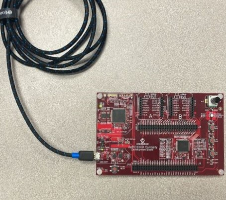
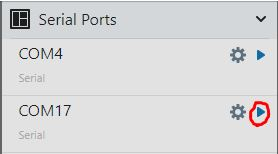
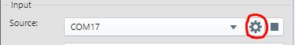
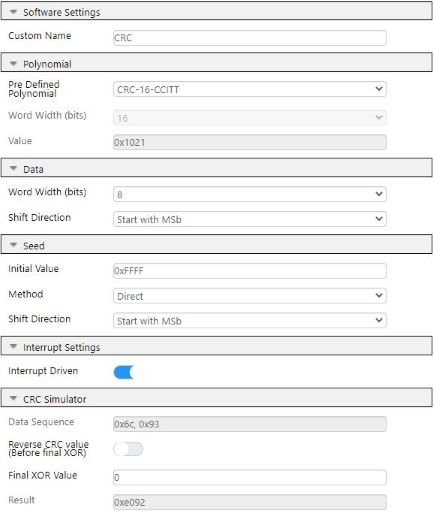
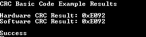

 

# dsPIC33CK Curiosity CRC Basic Code Example

The code example uses MPLAB® Code Configurator Melody CRC Driver to configure CRC using the standard CRC-16-CCITT settings and calculate the hardware CRC result. The hardware CRC computation is then compared with a software implementation to verify results. The result is displayed on the terminal.

## Related Documentation

[MCC Melody CRC API Reference](https://onlinedocs.microchip.com/v2/keyword-lookup?keyword=CRC_16BIT_MELODY_DRIVER&version=latest&redirect=true)

## Software Used 

### Required Software

- MPLAB® X IDE **6.15** or newer (https://www.microchip.com/MPLABXIDE)
- MPLAB® XC16 Compiler **2.10** or a newer compiler (https://www.microchip.com/xc16)
- MPLAB® Code Configurator (MCC) **5.5.7** or newer (https://www.microchip.com/mcc)
- MPLAB® Code Configurator (MCC) Melody **2.6.1** or newer (https://www.microchip.com/melody)
- CRC Driver **1.0.3** or newer (MCC Content Manager)
- CRC PLIB **1.3.0** or newer (MCC Content Manager)
- UART Driver **1.8.0** or newer (MCC Content Manager)
- UART PLIB **1.4.1** or newer (MCC Content Manager)
- Any terminal program, like the MPLAB® Data Visualizer (https://www.microchip.com/datavisualizer) or Tera Term (https://ttssh2.osdn.jp/index.html.en)

## Hardware Used

### Required Hardware

- [dsPIC33CK Curiosity Development Board (dsPIC33CK256MP508)](https://www.microchip.com/en-us/development-tool/DM330030)

## Hardware Setup

1. Connect the board to the PC using a USB cable.

    

## Software Setup

### Terminal Setup (Data Visualizer)

1. Launch the MPLAB® Data Visualizer.

    

2. Find the correct COM Port from the list on the left and click the play button.

    

3. Select the "Send to Terminal" button.

    

4. Click on the settings icon next to the source dropdown in the input section.

      

5. Verify that the serial port settings match the following:

    

### Terminal Setup (Tera Term)
1. Launch Tera Term
2. Go to File -> New Connection.
3. Select the "Serial" option and select the correct COM Port from the dropdown menu.

    

4. Go to Setup -> Serial port and ensure that the settings match the following:

    

### MPLAB® X IDE Setup
1. Launch MPLAB® X IDE and load the dspic33ck-curiosity-crc-basic project.
2. Build and program the device. 

## CRC Settings

This code example uses the following default settings for CRC-16-CCITT:

### Online Calculator

Online calculators can be used to test different configurations and try different settings. Most developers compare results with an online calculator for comparison purposes. An example that was used in the development of this code example is the [Online Calculator by Sven Reifegerste (Zorc)](http://www.zorc.breitbandkatze.de/crc.html).

For this code example, the calculation performed by the MCC Melody CRC Driver can be replicated with the online calculator by the following steps:
- Select "CRC-CCITT" button. 
- Enter "%38%37%36%35%34%33%32%31" in the "Data sequence."
  - Note: Putting "%" before a byte tells this calculator that it is in hexadecimal. Do not include spaces or leave out the "%", as the calculator will pass it as a string.
- Click the "compute" button.
  
The result should be 0x9B4D, matching the calculation performed by the MCC Melody CRC Driver.

## Operation

Once the project is built and the device is programmed, the terminal program will print the results of both the hardware and software calculations.

