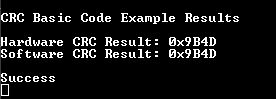

 

# dsPIC33CK Curiosity CRC Basic Code Example 

The code example uses MCC Melody CRC Driver to configure CRC using the standard CRC16-CCITT settings and calculate the hardware CRC result. The hardware CRC computation is then compared with a software implementation to verify results. The result is displayed on TeraTerm.

## Related Documentation

[MCC Melody CRC API Reference](https://onlinedocs.microchip.com/v2/keyword-lookup?keyword=CRC_16BIT_MELODY_DRIVER&version=latest&redirect=true)

## Software Used 

### Required Software

- MPLAB® X IDE **6.15** or newer (https://www.microchip.com/MPLABXIDE)
- MPLAB® XC16 Compiler **2.10** or a newer compiler (https://www.microchip.com/xc16)
- MPLAB® Code Configurator (MCC) **5.5.7** or newer (https://www.microchip.com/mcc)
- MPLAB® Code Configurator (MCC) Melody **2.6.1** or newer (https://www.microchip.com/melody)
- CRC Driver **1.0.3** or newer (MCC Melody Content Manager)
- CRC PLIB **1.3.0** or newer (MCC Melody Content Manager)
- TeraTerm

## Hardware Used

### Required Hardware

- [dsPIC33CK Curiosity Development Board (dsPIC33CK256MP508)](https://www.microchip.com/en-us/development-tool/DM330030)

## Hardware Setup

1. Connect the board to the PC using a USB cable.

## Software Setup

### TeraTerm Setup
1. Launch TeraTerm. 
2. Go to File -> New Connection.
3. Select the "Serial" option and select the correct COM Port from the dropdown menu.

### MPLAB® X IDE Setup
1. Launch MPLAB® X IDE and load the dspic33ck-curiosity-crc-basic project.
2. Build and program the device. 

## CRC Settings

This code example uses the default settings for CRC16-CCITT. These are as follows:

### Online Calculator

Online calculators can be used to test different configurations and try different settings. They can also be used to verify results obtained by hardware calculations.

[Online Calculator by Sven Reifegerste (Zorc)](http://www.zorc.breitbandkatze.de/crc.html)

For this code example, the calculation performed by the MCC Melody CRC Driver can be replicated with the online calculator by the following steps:
- Select "CRC-CCITT" button. 
- Enter "87654321" in the "Data sequence."
- Click the "compute" button.
  
The result should be 0x9B4D, matching the calculation performed by the MCC Melody CRC Driver.

## Operation

Once the project is built and the device is programmed, TeraTerm will print the results of both the hardware and software calculations.

